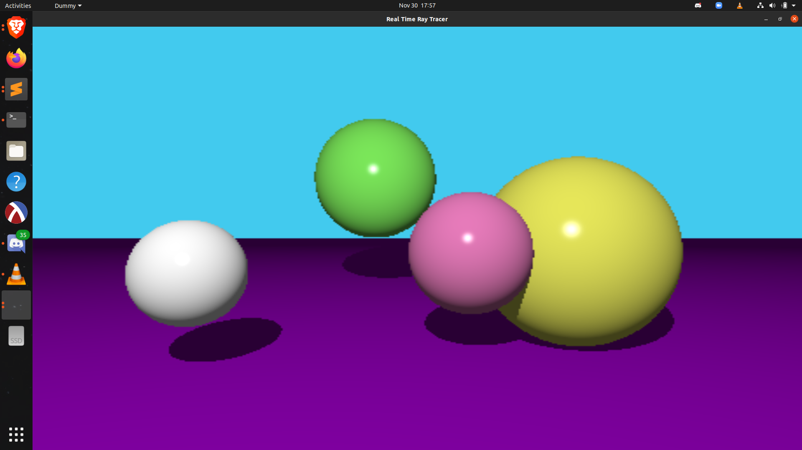
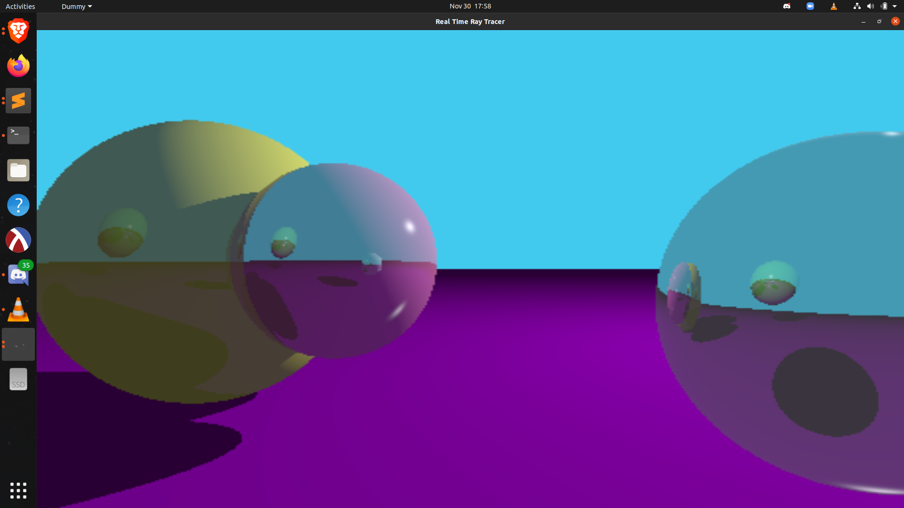
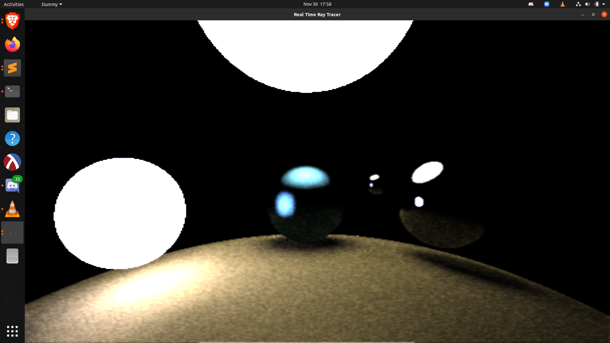

## Real Time Ray Tracer using Compute Shaders and OpenGL

Kevin Kellar, Noah Stapp, Justin Privitera

### Instructions to run:
* Requires OpenGL, GLFW, hardware that supports Compute Shaders
* Includes visual studio and cmake build tools. There is a run script (run.sh) that builds and runs using cmake.

### Controls:
* use WASD, space, and left shift to move
* QEZC to rotate
* F to toggle aspect ratio
* V to toggle the scene
* L to toggle light movement
* 1, 2, 3, and 4 to toggle the lighting algorithm

### Key Features:
* Compute Shaders
* OpenGL
* Keyboard input
* Choice of multiple lighting algorithms, including:
	+ Ray traced ambient occlusion with post processing (selection 1)
	+ Ray traced ambient occlusion (selection 2)
	+ Phong Diffuse Lighting (selection 3)
	+ Phong Diffuse Lighting with ray traced real time reflections (selection 4)
* Real time reflections
* Realistic shadowing
* Moving light source for phong diffuse
* Multisample Anti Aliasing
* Temporal Anti-Aliasing
* Spatial Anti-Aliasing

### How it works:
1. The CPU side prepares the scene and initializes everything
2. The first compute shader stage creates rays, intersects them with geometry, and bounces depending on the surface. It saves computed colors for each pixel, as well as normals and depth.
3. If ambient occlusion with post processing is enabled, then the post-processing compute shader blends pixels with the last several frames using Temporal and Spatial AA.

### Notes:
* This project originated as the final project for csc 572, graduate graphics. We were allowed to pick an open ended project to pursue in the last few weeks of the quarter.
* We've had considerable difficulty getting this project to run on multiple different computers; so perhaps there are some issues with the shaders that are not prevalent on the graphics cards we were able to run this on.
* Future ideas to expand on this include:
	+ smoothing edges
	+ Using textures to store past frames instead of frame buffers
	+ Scene object movements/animations
	+ Triangles, Rectangles, and other more complicated objects
	+ Importance Sampling to get better mileage out of ray calculations
	+ Bounding Volume Hierarchy once many objects are in each scene
	+ Obj files
* Additionally, the following things need to be tweaked or worked on...
	+ Post-processing
	+ Selective copying back from the GPU once shaders are done
	+ phong shaders should store normals and depth like AO shaders
