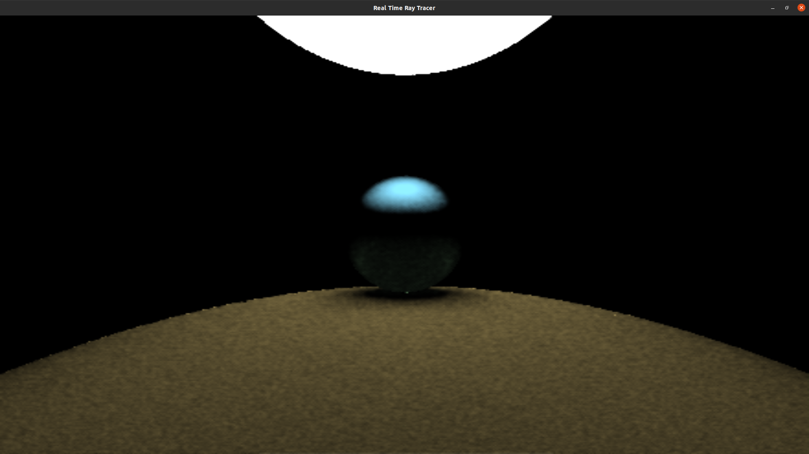
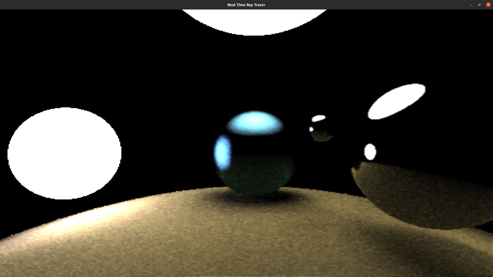

# final_project_csc572
final project for csc 572, graduate graphics

## Real Time Ray Tracer using Compute Shaders and OpenGL

### Controls:
* use WASD, space, and left shift to move
* QEZC to rotate
* F to toggle aspect ratio
* 1, 2, and 3 to toggle the scene

### Key Features:
* Compute Shaders
* OpenGL
* Keyboard input
* Ray traced ambient occlusion
* Real time reflections
* Realistic shadowing
* Multisample Anti Aliasing
* Temporal Anti-Aliasing
* Spatial Anti-Aliasing

### How it works:
1. The CPU side prepares the scene and initializes everything
2. The first compute shader stage creates rays, intersects them with geometry, and bounces depending on the surface. It saves computed colors for each pixel, as well as normals and depth.
3. The post-processing compute shader blends pixels with the last several frames using Temporal and Spatial AA.

### Notes:
* This project is incomplete. There are plans to add the following...
	+ Denoising based on number of recursive bounces
	+ Using textures to store past frames instead of frame buffers
	+ smoothing edges
* Some ideas that may or may not come to fruition:
	+ Scene object movements/animations
	+ Triangles, Rectangles, and other more complicated objects
	+ Importance Sampling to get better mileage out of ray calculations
	+ Bounding Volume Hierarchy once many objects are in each scene
	+ Obj files
* Additionally, the following things need to be tweaked or worked on...
	+ Post-processing
	+ Selective copying back from the GPU once shaders are done

